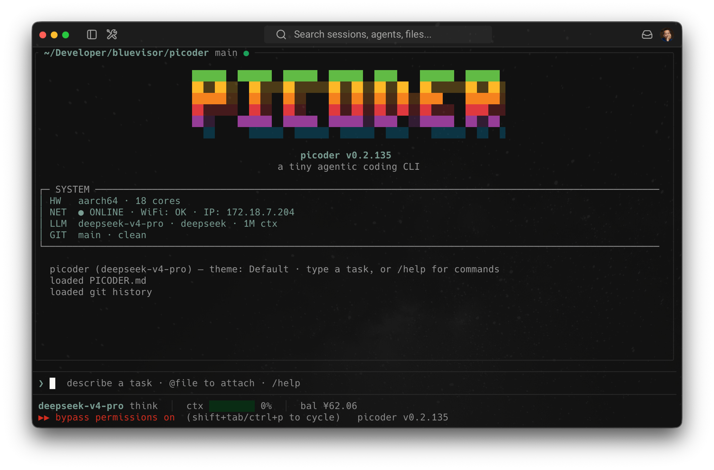

# picoder

A tiny full-screen **agentic coding CLI** written in Rust, small enough to run
on a **Raspberry Pi Zero W** (ARMv6, single core, ~512 MB RAM) — and equally at
home on a Pi 5 or your laptop. It talks to any OpenAI-compatible chat API
(default: DeepSeek) and drives a Codex / Claude-Code-style tool loop inside a
[ratatui](https://ratatui.rs) terminal UI.

The whole thing is one ~2.5 MB statically linked binary with no runtime
dependencies.



## Features

- **Agentic tool loop** — `bash` (with timeout, or detached `background` jobs +
  `bash_output` / `bash_kill`), `read_file` / `write_file` / `edit_file` /
  `list_files`, `multi_edit` (a batch of edits across files in one approval),
  `grep` (regex), `glob`, `web_fetch`, `web_search`, `todo` (a visible plan),
  `ask_user`, `view_image`, and `remember` / `recall` memory. A `max_tool_calls`
  budget (default 100, editable in `/config`) caps a single turn's tool calls.
- **Git auto-checkpoint** — every successful edit is committed to the
  working-directory repo (`auto_commit`, on by default), so each change is
  restorable; recent git history is fed into context as a clue.
- **Crash-safe state** — `config.json` and session transcripts are written
  atomically (temp file → fsync → rename), so a power loss on the Pi's SD card
  leaves the old or new file intact, never a truncated one.
- **Symlink-safe file tools** — `read_file` / `list_files` / `write_file` /
  `edit_file` all refuse symlinked paths, and paths are lexically normalized so
  the path you approve is the path that's used.
- **Sub-agents** — the `task` tool delegates a self-contained job to a fresh
  agent with its own context and the same tools; only its report comes back.
- **MCP** — stdio MCP servers from `mcp_servers` in `config.json` are launched
  at start; their tools show up as `mcp__<server>__<tool>` (`/mcp` lists them).
- **Subscription login** — `/login <anthropic|openai|google>` runs a browser
  OAuth 2.0 (PKCE) flow and authenticates with your Claude Pro/Max, ChatGPT, or
  Gemini account instead of a pay-as-you-go API key. Tokens persist to
  `config.json` (mode `0600`) and refresh automatically on resume; `auth_mode`
  (`api` / `sub`, in `/config`) selects which to send. The OAuth client ids are
  hand-rolled with zero extra crates; Google needs your own client id/secret via
  `PICODER_OAUTH_GOOGLE_CLIENT_ID` / `_CLIENT_SECRET`.
- **Images** — `@image.png` attaches as a base64 data URI and `view_image`
  loads one from disk, sent as OpenAI multimodal content parts.
- **Streaming TUI** — a Claude-style composer with a reverse-block cursor,
  live token streaming, and colored unified diffs previewed before every
  write/edit.
- **Context compaction** — `/compact` summarizes older turns to free the
  window; triggers automatically at 80% full.
- **Queued input** — keep typing while the agent works; Enter queues messages
  that send as turns finish.
- **One-shot `--output`** — `picoder "task" -o out.md` writes the final reply to
  disk after the run.
- **Permission modes** (`Shift+Tab` / `Ctrl+P` to cycle) — *ask* / *bypass* /
  *plan* (read-only).
- **Context files** — auto-loads `PICODER.md` / `AGENTS.md` / `CLAUDE.md` /
  `GEMINI.md` from the working directory.
- **Sessions** — persisted per working directory; resume with `picoder --continue`.
- **Composer niceties** — a `/` command palette (suggestions ranked by your
  usage; ↑/↓ select, Tab fills, Enter runs), `@file` attach, Tab autocomplete
  (commands + paths), history, word-skip and word-delete, code-block
  highlighting.
- **Status bar** — model · session tokens + $ cost · context-window bar ·
  account balance.
- **Settings panel** (`/config`) — provider preset, base URL, model, API key,
  auth mode, thinking mode, default permission mode, auto-commit, theme, context
  window, and max tool calls, edited in-TUI; changes apply live and persist to
  `config.json`.
- **Themes** (`/theme`) — `Default`, `Apple ][` (green phosphor), `MSDOS`,
  `macOS`, `SUN`, `NeXT`, and `SGI`.
- **Tuned for the Pi framebuffer console** — ASCII fallback and clear-on-exit
  under `TERM=linux`, plus a launch banner with live MEM / Wi-Fi / IP.

## Install / build

picoder is cross-compiled from macOS to static musl binaries (the Pi can't
compile Rust itself). Three targets are produced: **ARMv6** for the Pi Zero W,
**ARMv7** for 32-bit Pi OS on the Pi 2/3/4, and **aarch64** for the Pi 5 —
`deploy` picks the matching one per host via `uname -m`.

```sh
# one-time toolchain setup
brew install messense/macos-cross-toolchains/arm-unknown-linux-musleabihf
brew install messense/macos-cross-toolchains/aarch64-unknown-linux-musl
rustup target add arm-unknown-linux-musleabihf
rustup target add aarch64-unknown-linux-musl

./build.sh                        # build both targets
./build.sh deploy                 # build + install the right binary to every host in PICODER_HOSTS
PICODER_HOSTS="pi@host-a pi@host-b" ./build.sh deploy   # custom targets
PI=user@host ./build.sh deploy    # build + install to a single host
./build.sh pull                   # pull on-device self-edits back to the Mac
```

Deploy targets are configurable via the `PICODER_HOSTS` env var (space-separated
`user@host` list) or `PI=user@host` for a single host — set `PICODER_HOSTS` in
your shell profile to make it permanent. `deploy` queries each host's `uname -m`
and installs the matching ~2.5 MB static binary to `~/.local/bin/picoder`.

## Testing / CI

```sh
cargo test          # host unit tests
cargo test -- --ignored   # also runs the live MCP / web tests
```

GitHub Actions (`.github/workflows/ci.yml`) runs the host test suite plus a
`cross build --release` for all three deploy targets, so a broken cross-compile
is caught in CI instead of at deploy time.

## Configuration

On first run, picoder walks you through provider, model, and API key. State lives
in `~/.config/picoder/`:

```
config.json   provider / model / key, auth_mode, oauth tokens (0600),
              max_tool_calls (+ optional mcp_servers)
memory.md     remember/recall store
history       composer history
sessions/     per-directory session transcripts
```

To expose [MCP](https://modelcontextprotocol.io) tools, add an `mcp_servers`
block to `config.json`; each entry is launched over stdio at start and its
tools appear as `mcp__<server>__<tool>`:

```json
"mcp_servers": {
  "filesystem": {
    "command": "npx",
    "args": ["-y", "@modelcontextprotocol/server-filesystem", "/home/pi"]
  }
}
```

## Commands

Type `/` in the composer for the ranked palette, or `/help` for the full list.

| Command | Action |
| --- | --- |
| `/model [id\|n]` | open the model picker, or set directly by id/number |
| `/login <provider>` | sign in to a subscription (anthropic, openai, google) |
| `/config` | settings panel (provider, model, key, auth, thinking, …) |
| `/compact` | summarize older turns to free context (auto at 80%) |
| `/reset` | clear conversation context |
| `/new` | delete the session and start fresh |
| `/auto` | toggle bypass-permissions |
| `/mcp` | list configured MCP servers and their tools |
| `/memory` | show persistent memory |
| `/theme [n]` | open the theme picker, or switch directly |
| `/init` | summarize this project into `PICODER.md` |
| `/clear` | clear the screen transcript |
| `/help` · `/exit` | show help · quit |

## Keyboard

| Key | Action |
| --- | --- |
| `Enter` | send |
| `Shift+Tab` / `Ctrl+P` | cycle permission mode |
| `↑` / `↓` | history |
| `Alt`/`Ctrl`/`Cmd + ←/→` | word / line motion |
| `Option`/`Alt + Backspace` | delete word backward |
| `Option`/`Alt + Delete` | delete word forward |
| `Tab` | autocomplete commands / paths |
| `PgUp` / `PgDn` | scroll transcript |
| `Ctrl+L` | redraw screen |
| `Esc` | interrupt turn / clear line |
| `Ctrl+C` | quit (press twice) |

picoder enables the [Kitty keyboard protocol](https://sw.kovidgoyal.net/kitty/keyboard-protocol/)
when the terminal supports it, so modified keys are reported unambiguously.
Without it, some terminals (e.g. Warp in full-screen mode) flatten
`Option+Backspace` to a plain Backspace.

## Architecture

A long-lived **worker thread** owns the message history and runs the blocking
HTTP + tool loop. The **UI thread** renders with ratatui and exchanges user
input / approvals over mpsc channels; the worker streams back tokens, tool
events, diffs, and approval requests. This keeps the UI responsive and lets
`Esc` interrupt a turn mid-flight.

The transcript render is cached: the static (already-printed) lines are wrapped
once and reused until their content or the terminal width changes, so streaming
a reply doesn't re-wrap the whole backlog every token — the difference is
visible on a single-core Pi.

See [`PICODER.md`](PICODER.md) for the per-file source map and deeper notes.

## License

MIT
